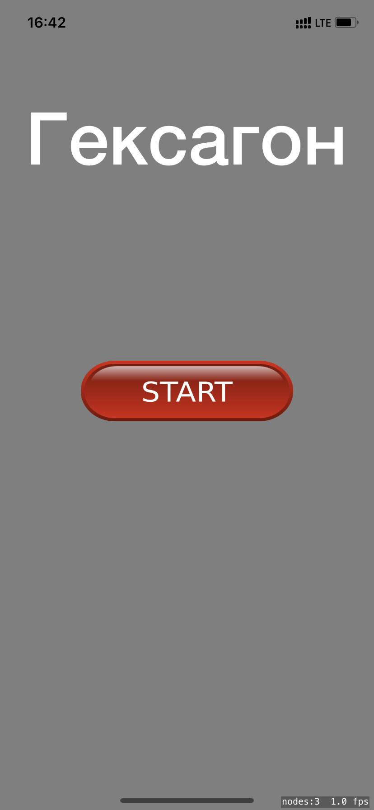
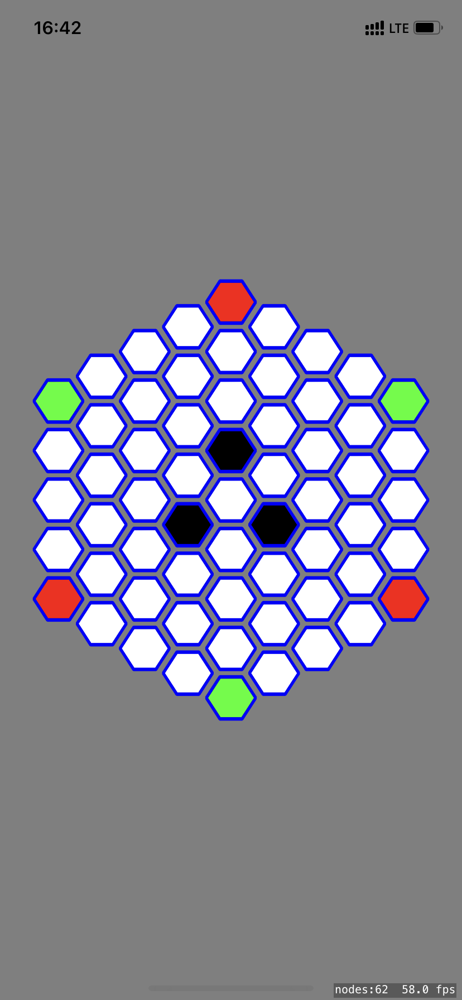

## HexagonGame

Курсовая работа

**Курс**: 2

**Название**: "Игра Гексагон"

**Предмет**: Технологии программирования

**Задание**: Написать программу, играющую в Гексагон.

**Правила игры**:
Поле состоит из 6-гранных клеток. Размер поля – по выбору.
Два игрока ходят по очереди. Возможны ходы:
1) Поставить новую свою шашку на любую свободную из 6 клеток, смежных со своей шашкой.
2) Переставить свою шашку на любую свободную клетку, смежную с клетками, смежными с прежним положением этой шашки.
В любом случае, если на клетках, смежных с новым положением своей шашки, есть шашки противника, они заменяются на свои. 
Игра заканчивается, когда все клетки заняты. Выигрывает тот, кто занял больше клеток.

#### Демонстрация

  
&nbsp; &nbsp;
  

